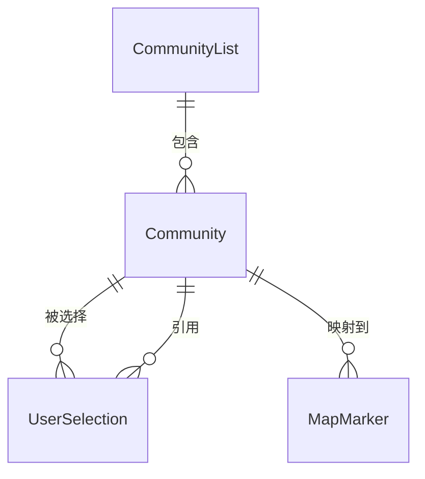

# 数据模型：社区选择页面

**功能**: 社区选择页面 | **日期**: 2025-01-16
**参考**: [spec.md](./spec.md), [research.md](./research.md)

## 实体定义

### 1. Community (社区)

表示一个地理位置的服务区域。

**字段**:

| 字段名 | 类型 | 必填 | 说明 | 示例值 |
|--------|------|------|------|--------|
| `id` | string | ✅ | 社区唯一标识符 | "comm_001" |
| `name` | string | ✅ | 社区名称 | "阳光花园" |
| `fullAddress` | string | ✅ | 完整地址 | "北京市朝阳区xxx路123号" |
| `shortAddress` | string | ✅ | 简短地址（用于列表显示） | "朝阳区xxx路" |
| `latitude` | number | ✅ | 纬度 | 39.9042 |
| `longitude` | number | ✅ | 经度 | 116.4074 |
| `serviceRange` | string | ✅ | 服务范围描述 | "覆盖3公里以内" |
| `status` | string | ✅ | 运营状态：`"active"` \| `"inactive"` | "active" |
| `createdAt` | number | ✅ | 创建时间戳 | 1705392000000 |
| `updatedAt` | number | ✅ | 更新时间戳 | 1705392000000 |

**验证规则**:
- `id`: 非空字符串，格式 `comm_` + 数字或 UUID
- `name`: 长度 2-50 字符
- `latitude`: 范围 -90 到 90
- `longitude`: 范围 -180 到 180
- `status`: 只能是 `"active"` 或 `"inactive"`

**TypeScript 定义**:

```typescript
interface Community {
  id: string;
  name: string;
  fullAddress: string;
  shortAddress: string;
  latitude: number;
  longitude: number;
  serviceRange: string;
  status: 'active' | 'inactive';
  createdAt: number;
  updatedAt: number;
}
```

### 2. UserSelection (用户选择)

记录用户当前选择的社区。

**字段**:

| 字段名 | 类型 | 必填 | 说明 | 示例值 |
|--------|------|------|------|--------|
| `communityId` | string | ✅ | 用户选择的社区 ID | "comm_001" |
| `selectedAt` | number | ✅ | 选择时间戳 | 1705392000000 |
| `updatedAt` | number | ✅ | 最后更新时间戳 | 1705392000000 |

**验证规则**:
- `communityId`: 必须对应一个有效的 `Community.id`
- `selectedAt`: Unix 时间戳（毫秒）
- `updatedAt`: 必须大于等于 `selectedAt`

**TypeScript 定义**:

```typescript
interface UserSelection {
  communityId: string;
  selectedAt: number;
  updatedAt: number;
}
```

### 3. CommunityList (社区列表)

所有可选社区的集合。

**字段**:

| 字段名 | 类型 | 必填 | 说明 | 示例值 |
|--------|------|------|------|--------|
| `communities` | Community[] | ✅ | 社区数组 | `[{...}, {...}]` |
| `total` | number | ✅ | 总数 | 200 |
| `cachedAt` | number | ❓ | 缓存时间戳 | 1705392000000 |

**排序支持**:
- 按距离排序：需要提供用户位置参数
- 按名称排序：字母顺序

**TypeScript 定义**:

```typescript
interface CommunityList {
  communities: Community[];
  total: number;
  cachedAt?: number;
}

type SortBy = 'distance' | 'name';
```

### 4. MapMarker (地图标记点)

地图组件使用的标记点数据。

**字段**:

| 字段名 | 类型 | 必填 | 说明 | 示例值 |
|--------|------|------|------|--------|
| `id` | number | ✅ | 标记点唯一 ID | 1 |
| `latitude` | number | ✅ | 纬度 | 39.9042 |
| `longitude` | number | ✅ | 经度 | 116.4074 |
| `title` | string | ✅ | 标题 | "阳光花园" |
| `iconPath` | string | ❓ | 自定义图标路径 | "/assets/marker.png" |
| `width` | number | ❓ | 图标宽度（像素） | 24 |
| `height` | number | ❓ | 图标高度（像素） | 24 |
| `alpha` | number | ❓ | 透明度（0-1） | 1.0 |
| `isSelected` | boolean | ❓ | 是否为当前选中的社区 | false |

**TypeScript 定义**:

```typescript
interface MapMarker {
  id: number;
  latitude: number;
  longitude: number;
  title: string;
  iconPath?: string;
  width?: number;
  height?: number;
  alpha?: number;
  isSelected?: boolean;
}
```

## 实体关系



**关系说明**:
1. `UserSelection` 引用单个 `Community`（多对一）
2. `CommunityList` 包含多个 `Community`（一对多）
3. 每个 `Community` 可映射为一个 `MapMarker`（一对一）

## 状态转换

### Community 生命周期

```
[创建] → active
  ↓
inactive (下线)
  ↓
[删除] (仅从列表移除，数据库保留)
```

**规则**:
- 新创建的社区默认状态为 `active`
- 只有管理员可以修改 `status`
- `inactive` 状态的社区仍存在于数据中，但对用户不可见
- 用户已选择的社区变为 `inactive` 时，需提示用户重新选择

### UserSelection 生命周期

```
[首次选择] → UserSelection(communityId=A)
  ↓
[切换社区] → UserSelection(communityId=B, updatedAt=now)
  ↓
[清除数据] → null (本地存储丢失)
  ↓
[重新选择] → UserSelection(communityId=C)
```

**规则**:
- 切换社区时更新 `communityId` 和 `updatedAt`
- `selectedAt` 保持不变（记录首次选择时间）
- 本地存储丢失时，返回 `null`，触发选择页面

## 存储模型

### 本地存储键值对

| 键名 | 类型 | 说明 | 示例 |
|------|------|------|------|
| `selected_community` | string (Base64编码) | 用户选择的社区（加密存储） | `"eyJjb21tdW5pdHlJZCI6ImNvbW1fMDAxIn19="` |
| `communities_cache` | string (JSON) | 社区列表缓存 | `"{\"communities\":[...],\"cachedAt\":1705392000000}"` |
| `communities_cache_meta` | string (JSON) | 缓存元数据（TTL等） | `"{\"ttl\":604800000,\"version\":1}"` |

**存储大小估算**:
- `selected_community`: ~100 字节
- `communities_cache`: 100-250 KB（200-500 个社区）
- 总计: < 300 KB，远低于微信小程序 10MB 限制

### Zustand Store 结构

```typescript
interface CommunityStore {
  // 状态
  selectedCommunity: Community | null;
  communities: Community[];
  viewMode: 'map' | 'list';
  isLoading: boolean;
  error: string | null;
  lastFetchTime: number;

  // 操作
  setSelectedCommunity: (community: Community) => void;
  setCommunities: (communities: Community[]) => void;
  setViewMode: (mode: 'map' | 'list') => void;
  setLoading: (loading: boolean) => void;
  setError: (error: string | null) => void;
  switchCommunity: (communityId: string) => Promise<void>;
  refreshCommunities: () => Promise<void>;
  loadFromCache: () => Promise<void>;
}
```

## 数据流

### 1. 应用启动流程

```
1. 读取本地存储 (selected_community)
   ├─ 成功 → 自动加载社区，跳转到主页
   └─ 失败 → 显示社区选择页面

2. 加载社区列表
   ├─ 读取缓存 (communities_cache)
   │  └─ 立即显示（快速响应）
   └─ 后台请求最新数据
      ├─ 成功 → 更新缓存 + 更新 UI
      └─ 失败 → 保持使用缓存（如有）
```

### 2. 选择社区流程

```
1. 用户点击社区
   ↓
2. 更新 Zustand Store (selectedCommunity)
   ↓
3. 加密存储到本地 (selected_community)
   ↓
4. 跳转到主页
```

### 3. 切换社区流程

```
1. 用户点击"切换社区"
   ↓
2. 打开社区选择页面（高亮当前社区）
   ↓
3. 用户选择新社区
   ↓
4. 更新 Zustand Store
   ↓
5. 加密存储到本地
   ↓
6. 显示提示消息
   ↓
7. 返回主页（刷新数据）
```

## 索引与查询优化

### 社区列表查询

**按距离筛选**:
- 计算公式：Haversine 距离公式
- 前端筛选：从完整列表中计算距离并排序
- 后端筛选：API 支持参数 `lat`, `lng`, `radius`

**按名称搜索**（不在当前范围）:
- 未来可添加：前缀匹配或模糊搜索
- 使用 `Array.filter()` + `includes()`

### 地图标记点优化

**聚类策略**（当社区数 > 100）:
- 将相近社区聚合为单个标记点
- 点击聚类标记时放大地图显示子社区

**按需加载**:
- 仅加载当前可视区域内的社区标记
- 监听地图 `regionchange` 事件动态加载

## 数据一致性

### 缓存更新策略

**策略**: 后台静默更新 + TTL 过期

```
1. 应用启动
   └─ 加载缓存（无论是否过期）

2. 检查 TTL
   ├─ 未过期 → 标记为"可能不是最新"
   └─ 已过期 → 优先显示缓存，后台刷新

3. 后台刷新
   ├─ 成功 → 更新缓存，移除"可能不是最新"提示
   └─ 失败 → 保持缓存，显示错误提示（可选）
```

**冲突解决**:
- 用户正在浏览时，后台数据更新不立即刷新 UI
- 用户下次打开选择页面时显示最新数据
- 当前选中的社区被下线时，立即提示用户重新选择

### 并发控制

**问题**: 用户快速切换社区时的竞态条件

**解决方案**:
- 使用 `loading` 状态防止重复请求
- 每次切换社区时取消之前的待处理请求
- 使用请求序列号或时间戳识别最新请求

```typescript
let requestId = 0;

const switchCommunity = async (communityId: string) => {
  const currentRequestId = ++requestId;
  const result = await api.selectCommunity(communityId);

  // 仅处理最新的请求结果
  if (currentRequestId === requestId) {
    updateUI(result);
  }
};
```

## 扩展性考虑

### 未来可能的需求

1. **多社区同时选择**（收藏功能）
   - 数据模型扩展：`UserSelection.favorites: string[]`
   - 存储扩容：多个社区 ID 的数组

2. **社区搜索功能**
   - 新增接口：`GET /api/communities?q=keyword`
   - 前端实现：搜索框 + 实时搜索

3. **社区评价和反馈**
   - 新增实体：`CommunityReview`
   - 关系：`Community` 1:N `CommunityReview`

4. **服务范围多边形**
   - 扩展字段：`Community.serviceArea: GeoJSON`
   - 地图渲染：多边形覆盖层

### 数据迁移策略

当数据模型变更时：
1. 版本化存储数据（添加 `version` 字段）
2. 应用启动时检查版本，执行迁移脚本
3. 迁移失败时降级到默认数据

```typescript
const migrateData = (data: any, version: number) => {
  if (version === 1) {
    // 迁移到版本 2
    return { ...data, newField: defaultValue };
  }
  return data;
};
```
