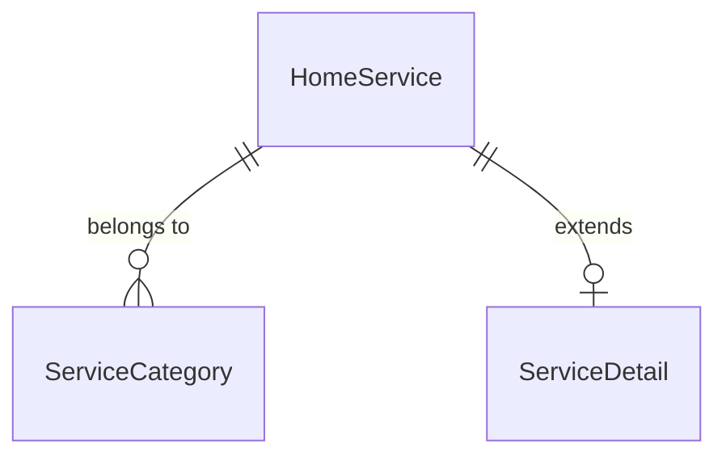
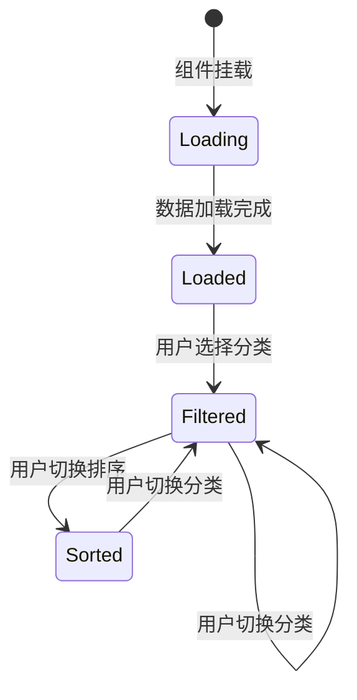

# Data Model: 上门服务页面

**Feature**: 上门服务页面
**Date**: 2026-01-18
**Status**: Draft

## Overview

本文档定义上门服务页面涉及的数据实体、字段定义、验证规则和实体关系。

## Entities

### 1. HomeService (上门服务)

代表一个可预约的上门服务项目。

**Fields**:

| Field Name | Type | Required | Description | Example |
|------------|------|----------|-------------|---------|
| id | string | Yes | 服务唯一标识符 | "service-001" |
| name | string | Yes | 服务名称 | "专业家政清洁" |
| poster | string | Yes | 服务海报图片 URL | "https://picsum.photos/seed/cleaning/300/300" |
| price | number | Yes | 服务价格（元） | 128 |
| sales | number | Yes | 已售数量 | 234 |
| category | string | Yes | 服务分类标识 | "cleaning" |
| description | string | No | 服务描述 | "专业的家庭清洁服务..." |

**Validation Rules**:
- `id`: 非空字符串，唯一标识
- `name`: 非空字符串，长度 1-50 字符
- `poster`: 有效的 URL 字符串
- `price`: 非负数，0 表示免费服务
- `sales`: 非负整数
- `category`: 必须匹配预定义的分类标识
- `description`: 可选，长度 0-500 字符

**TypeScript Interface**:

```typescript
interface HomeService {
  id: string
  name: string
  poster: string
  price: number
  sales: number
  category: string
  description?: string
}
```

### 2. ServiceCategory (服务分类)

代表服务的类型分类。

**Fields**:

| Field Name | Type | Required | Description | Example |
|------------|------|----------|-------------|---------|
| key | string | Yes | 分类唯一标识符 | "cleaning" |
| name | string | Yes | 分类显示名称 | "家政清洁" |
| icon | string | No | 分类图标（emoji 或图标名称） | "🧹" |

**Validation Rules**:
- `key`: 非空字符串，唯一标识
- `name`: 非空字符串，长度 1-20 字符
- `icon`: 可选，长度 0-10 字符

**TypeScript Interface**:

```typescript
interface ServiceCategory {
  key: string
  name: string
  icon?: string
}
```

### 3. ServiceDetail (服务详情)

服务的完整信息，用于详情页展示。

**Extends**: `HomeService`

**Additional Fields**:

| Field Name | Type | Required | Description | Example |
|------------|------|----------|-------------|---------|
| images | string[] | No | 服务图片数组 | ["url1", "url2"] |
| specifications | object | No | 服务规格说明 | { "时长": "2小时", "服务人数": "2人" } |
| rating | number | No | 服务评分（0-5） | 4.8 |
| reviewCount | number | No | 评价数量 | 156 |

**Validation Rules**:
- `images`: 数组，每个元素为有效 URL
- `specifications`: 键值对对象，值为字符串
- `rating`: 0-5 之间的浮点数
- `reviewCount`: 非负整数

**TypeScript Interface**:

```typescript
interface ServiceDetail extends HomeService {
  images?: string[]
  specifications?: { [key: string]: string }
  rating?: number
  reviewCount?: number
}
```

## Entity Relationships



**Relationships**:
- 一个 `HomeService` 属于一个 `ServiceCategory`
- 一个 `HomeService` 可以扩展为一个 `ServiceDetail`

## Predefined Categories

系统预定义的服务分类：

| Key | Name | Icon |
|-----|------|------|
| all | 全部 | 🏠 |
| cleaning | 家政清洁 | 🧹 |
| repair | 维修服务 | 🔧 |
| care | 护理照护 | 💊 |
| life | 生活服务 | 🛒 |

## State Management

### Component State (useState)

```typescript
interface HomeServiceState {
  activeCategory: string      // 当前选中的分类
  sortType: SortType          // 排序类型: 'none' | 'asc' | 'desc'
  serviceList: HomeService[]  // 筛选后的服务列表
}

type SortType = 'none' | 'asc' | 'desc'
```

### State Transitions



## Data Flow

1. **Initial Load**:
   - 组件挂载 → 加载所有服务数据
   - 默认 `activeCategory = 'all'`, `sortType = 'none'`

2. **Category Filter**:
   - 用户点击分类标签 → 更新 `activeCategory`
   - 触发 `applyFilters()` → 筛选并排序数据
   - 更新 `serviceList` → 重新渲染

3. **Price Sort**:
   - 用户点击排序按钮 → 更新 `sortType`
   - 触发 `applyFilters()` → 排序当前筛选结果
   - 更新 `serviceList` → 重新渲染

## Mock Data Structure

```typescript
// 分类配置
export const categoryConfig = {
  all: { name: '全部', icon: '🏠' },
  cleaning: { name: '家政清洁', icon: '🧹' },
  repair: { name: '维修服务', icon: '🔧' },
  care: { name: '护理照护', icon: '💊' },
  life: { name: '生活服务', icon: '🛒' }
}

// 服务列表
export const mockServiceList: HomeService[] = [
  {
    id: '1',
    name: '专业家政清洁',
    poster: 'https://picsum.photos/seed/cleaning/300/300',
    price: 128,
    sales: 234,
    category: 'cleaning',
    description: '专业的家庭清洁服务...'
  },
  // ... more services
]
```

## Edge Cases and Constraints

1. **Empty Category**: 当分类下没有服务时，显示空状态
2. **Free Service**: 价格为 0 时显示"免费"
3. **Zero Sales**: 销量为 0 时显示"暂无销量"
4. **Image Load Failure**: 图片加载失败时显示占位图
5. **Category Overflow**: 分类标签过多时支持横向滚动
