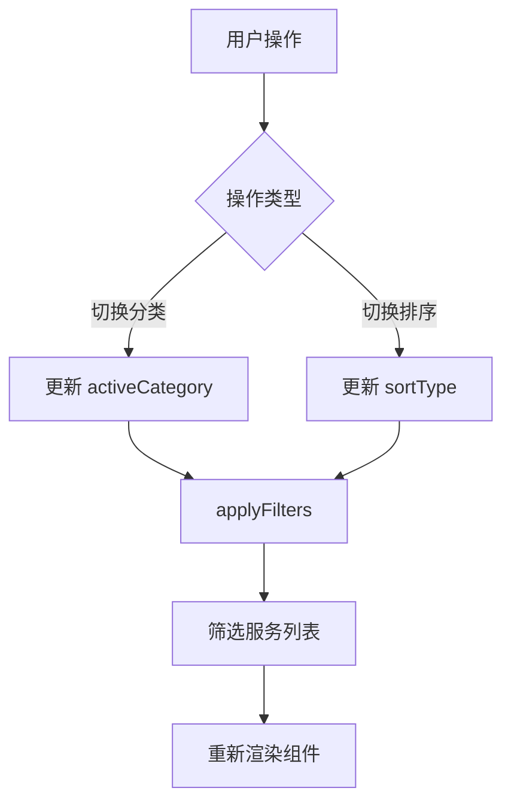

# Research: 上门服务页面

**Feature**: 上门服务页面
**Date**: 2026-01-18
**Status**: Complete

## Overview

本文档记录上门服务页面开发过程中的技术决策和最佳实践研究。由于该功能参考现有的 ElderlyMall 组件设计，技术栈已明确，无需额外的技术调研。

## Technical Decisions

### 1. 组件架构模式

**Decision**: 采用与 ElderlyMall 相同的组件结构

**Rationale**:
- ElderlyMall 组件已经过验证，适合老年用户群体
- 复用现有设计模式保持代码一致性
- 减少学习成本和开发时间

**Alternatives Considered**:
- 创建全新的组件结构：考虑到与现有代码的一致性和维护成本，未采用

### 2. 状态管理方案

**Decision**: 使用 React useState 组件内部状态管理

**Rationale**:
- 该页面的状态相对简单（当前分类、排序类型、筛选后的服务列表）
- 不需要跨组件共享状态
- ElderlyMall 已采用此方案，效果良好

**Alternatives Considered**:
- Zustand 全局状态管理：对于单一组件的局部状态过于复杂
- Context API：组件层级扁平，无需跨层级传递

### 3. 图片加载策略

**Decision**: 使用 Taro Image 组件的 lazyLoad 属性实现懒加载

**Rationale**:
- Taro 原生支持懒加载，无需额外依赖
- 有效提升首屏加载性能
- 符合移动端最佳实践

**Error Handling**:
- 图片加载失败时显示默认占位图
- 使用 Taro 的 onError 事件捕获加载失败

### 4. 样式方案

**Decision**: 继续使用 SCSS (Sass)

**Rationale**:
- 项目已配置 Sass，保持一致性
- 支持嵌套、变量等特性，便于维护
- ElderlyMall 和其他组件都使用 SCSS

**Alternatives Considered**:
- CSS-in-JS (如 styled-components)：与现有项目结构不匹配
- Tailwind CSS：需要额外配置，增加依赖

### 5. 无障碍设计 (Accessibility)

**Decision**: 针对老年用户的界面优化

**Implementation**:
- 使用较大的字体尺寸（至少 16px 基准）
- 高对比度的颜色方案
- 清晰的视觉反馈（点击态、加载态）
- 简洁的操作流程

**Rationale**:
- 目标用户群体主要是老年人
- 提升易用性和用户体验
- 符合无障碍设计原则

## Data Flow

## Performance Considerations

1. **列表渲染优化**:
   - 使用 Taro 的虚拟化支持（如需要）
   - 图片懒加载减少首屏加载时间

2. **筛选优化**:
   - 筛选逻辑在内存中完成，响应快速
   - 避免频繁的状态更新和重新渲染

3. **图片优化**:
   - 使用适当尺寸的占位图片
   - 启用懒加载

## Open Questions

无 - 所有技术决策已明确。

## References

- ElderlyMall 组件源码: `src/pages/joy/components/ElderlyMall/`
- Taro 官方文档: https://taro-docs.jd.com/
- React 官方文档: https://react.dev/
