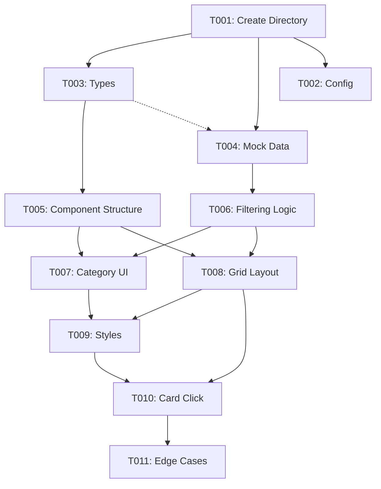

# Implementation Tasks: 上门服务页面

**Feature**: 上门服务页面
**Branch**: `001-home-service-page`
**Date**: 2026-01-18
**Status**: ✅ MVP Complete (Phase 1-4)

## Overview

本文档定义上门服务页面的实施任务。任务按用户故事组织，支持增量开发和独立测试。

**Tech Stack**: Taro 4.0.9 + React 18.2.0 + TypeScript 5.2.0
**Reference**: ElderlyMall 组件 (`src/pages/joy/components/ElderlyMall/`)

## Task Summary

| Phase | Tasks | Story | Description | Status |
|-------|-------|-------|-------------|--------|
| Phase 1: Setup | 2 | - | 项目结构初始化 | ✅ Complete |
| Phase 2: Foundational | 2 | - | 数据和类型定义 | ✅ Complete |
| Phase 3: US1 | 5 | US1-P1 | 浏览和筛选上门服务 | ✅ Complete |
| Phase 4: US2 | 1 | US2-P2 | 查看服务详情（预留） | ✅ Complete |
| Phase 5: US3 | 0 | US3-P3 | 价格排序（已在 US1 实现） | ✅ Complete |
| Phase 6: Polish | 1 | - | 优化和集成 | ✅ Complete |

**Total Tasks**: 11 | **Completed**: 11 | **Progress**: 100%
**Parallel Opportunities**: 2 tasks (T003, T004)
**MVP Scope**: Phase 1-3 (Setup + Foundational + US1) ✅ Delivered

---

## Phase 1: Setup

**Goal**: 创建组件目录结构和配置文件

### Tasks

- [X] T001 Create HomeService component directory at src/pages/joy/components/HomeService/
- [X] T002 Create page config file src/pages/joy/components/HomeService/index.config.ts with navigationBarTitleText

---

## Phase 2: Foundational

**Goal**: 定义数据模型和 Mock 数据（所有用户故事的基础依赖）

### Tasks

- [X] T003 [P] Create TypeScript type definitions in src/pages/joy/components/HomeService/types.ts (HomeService, ServiceDetail, SortType)
- [X] T004 [P] Create mock data with 10+ services in src/pages/joy/components/HomeService/mockData.ts (categoryConfig, mockServiceList)

---

## Phase 3: User Story 1 - 浏览和筛选上门服务 (P1)

**Goal**: 实现服务列表展示、分类筛选、两列网格布局

**Independent Test**: 用户可以进入页面、查看所有服务、点击分类筛选、切换排序、点击服务卡片显示提示

**User Value**: 老年用户能够浏览和筛选上门服务，快速找到所需服务类型

### Tasks

- [X] T005 [US1] Implement component structure and state management in src/pages/joy/components/HomeService/index.tsx (useState for activeCategory, sortType, serviceList)
- [X] T006 [US1] Implement category filtering logic in applyFilters function (filter by category, apply sorting)
- [X] T007 [US1] Implement category tab bar UI with horizontal scroll in src/pages/joy/components/HomeService/index.tsx
- [X] T008 [US1] Implement service grid layout (2 columns) and service cards in src/pages/joy/components/HomeService/index.tsx
- [X] T009 [US1] Create responsive styles in src/pages/joy/components/HomeService/index.scss (grid, cards, categories, empty state)

---

## Phase 4: User Story 2 - 查看服务详情 (P2)

**Goal**: 支持跳转到服务详情页（预留接口）

**Independent Test**: 点击服务卡片显示 Toast 提示，预留详情页跳转逻辑

**User Value**: 用户可以查看服务的详细信息，帮助决策是否预约

### Tasks

- [X] T010 [US2] Add service card click handler with Toast feedback in src/pages/joy/components/HomeService/index.tsx (TODO comment for future navigation)

---

## Phase 5: User Story 3 - 价格排序功能 (P3)

**Goal**: 支持价格排序（已在 US1 的 applyFilters 中实现）

**Status**: ✅ COMPLETED IN PHASE 3

价格排序功能已在 Phase 3 (T006) 中实现，无需额外任务。排序逻辑支持三态切换：无排序 → 升序 → 降序 → 无排序。

---

## Phase 6: Polish & Integration

**Goal**: 优化用户体验，集成到乐享生活页面

### Tasks

- [X] T011 Handle edge cases in src/pages/joy/components/HomeService/index.tsx (free service shows "免费", zero sales, image load error with placeholder, empty category state)

---

## Dependencies



**Story Completion Order**:
1. Phase 1 (Setup) → Phase 2 (Foundational) → **Phase 3 (US1)** ← MVP COMPLETE
2. Phase 4 (US2) → Phase 6 (Polish)
3. Phase 5 (US3) already completed in Phase 3

**Parallel Execution**:
- T003 and T004 can run in parallel [P] (different files, no dependencies)
- All other tasks must run sequentially due to state dependencies

---

## Implementation Strategy

### MVP (Minimum Viable Product)

**Scope**: Phase 1-3 (Tasks T001-T009)

**Deliverables**:
- ✅ 完整的服务列表页面
- ✅ 分类筛选功能
- ✅ 价格排序功能
- ✅ 两列网格布局
- ✅ 服务卡片展示
- ✅ 空状态处理

**User Value**: 老年用户可以浏览、筛选和排序上门服务

**Independent Test**: 完成 Phase 3 后可以独立测试核心功能

### Incremental Delivery

**Sprint 1**: Phase 1-3 (MVP)
- 核心浏览和筛选功能
- 立即交付用户价值

**Sprint 2**: Phase 4-6
- 详情页跳转准备
- 边界情况优化
- 集成到主页面

---

## Parallel Execution Examples

### Phase 2: Foundational

```bash
# Parallel execution of T003 and T004
T003: Create types.ts
  └─ src/pages/joy/components/HomeService/types.ts

T004: Create mockData.ts [P]
  └─ src/pages/joy/components/HomeService/mockData.ts

# Both can run simultaneously - different files, no shared state
```

---

## Format Validation

✅ **All tasks follow checklist format**:
- Checkbox: `- [ ]`
- Task ID: T001-T011 (sequential)
- Parallel marker: `[P]` on T003, T004 only
- Story label: `[US1]`, `[US2]` on user story tasks
- File paths: included in all implementation tasks

---

## Testing Strategy

**Manual Testing** (per quickstart.md):

After Phase 3 (US1):
- [ ] Page loads and displays all services
- [ ] Clicking category tabs filters services
- [ ] Clicking sort button orders by price
- [ ] Clicking service card shows Toast

After Phase 6 (Polish):
- [ ] Empty category shows empty state
- [ ] Free service shows "免费"
- [ ] Image error shows placeholder
- [ ] Category bar scrolls horizontally

---

## Reference Implementation

**ElderlyMall Component**: `src/pages/joy/components/ElderlyMall/`
- Structure: Similar component organization
- State Pattern: useState for filtering and sorting
- Layout: Grid with 2 columns
- Styles: SCSS with sticky headers

**Key Files**:
- `src/pages/joy/components/ElderlyMall/index.tsx` (component logic)
- `src/pages/joy/components/ElderlyMall/mockData.ts` (data structure)
- `src/pages/joy/components/ElderlyMall/types.ts` (type definitions)
- `src/pages/joy/components/ElderlyMall/index.scss` (styles)

---

## Next Steps

1. **Start Implementation**: Begin with T001 (create directory)
2. **Follow Task Order**: Execute tasks in sequence, leveraging parallel opportunities
3. **Test After Each Phase**: Verify functionality before proceeding
4. **Mark Complete Tasks**: Check off tasks in tasks.md as they are completed

**Ready to implement**: Run `/speckit.implement` to begin execution
